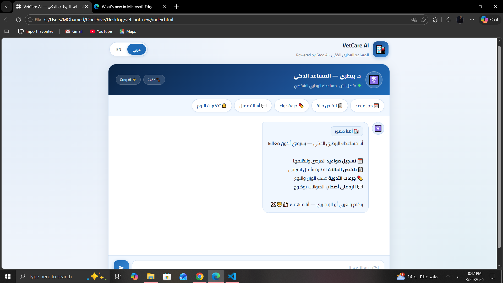

# AI Smart Chatbot 🤖💬

A versatile chatbot built with Python that can handle user inquiries and provide intelligent responses.

## ✨ Features
- **Natural Language Processing:** Understands and processes user intent.
- **Real-time Interaction:** Quick response generation.
- **Customizable:** Can be integrated with various APIs (OpenAI/Gemini/Custom Models).

## 📸 Conversation Demo

## 🚀 Installation & Usage
1. Clone the repo: `git clone https://github.com/mo-nasser5/AI-Smart-Chatbot`
2. Install libraries: `pip install -r requirements.txt`
3. Run the bot: `python chatbot.py`

## 🛠️ Tech Stack
- **Python**
- **NLTK / SpaCy** (or OpenAI API if used)
- **JSON** (for training data/conversations)
